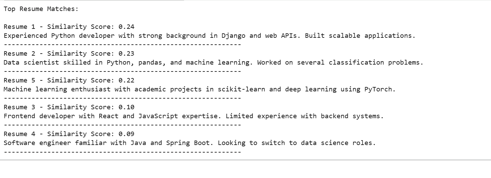

### Resume-screening-system(TF‑IDF + Cosine Similarity)

### 📌 Project Overview

This project demonstrates a simple resume screening system that compares resumes to a job description using TF‑IDF vectorization and cosine similarity. The goal is to identify which resumes are most relevant to the job post.

### ✨ What This Project Does

🔍 Automated Evaluation: Analyzes resume text programmatically

📄 Text Vectorization: Converts resumes and job descriptions into TF‑IDF vectors

📊 Similarity Scoring: Uses cosine similarity to measure relevance

🏆 Ranking: Outputs resumes from most to least relevant

### 🧠 Key Concepts

TF‑IDF (Term Frequency–Inverse Document Frequency)

Cosine Similarity

Basic NLP text processing

### ▶️ How the Code Works

📄 Load Text Data

A job description is defined as a string

Multiple resumes are stored in a list

🧮 TF‑IDF Vectorization

All documents (job description + resumes) are converted into TF‑IDF vectors

📊 Cosine Similarity Calculation

The similarity between the job description and each resume is computed

🏆 Ranking Resumes

Resumes are sorted based on similarity scores

The script prints the ranking and similarity score for each resume

### 🎯 Purpose of This Project

This project demonstrates how simple NLP techniques can be used to:

Compare resumes to job descriptions

Score and rank candidates

Build a foundation for automated resume screening tools

## 📸 Output Screenshot 

